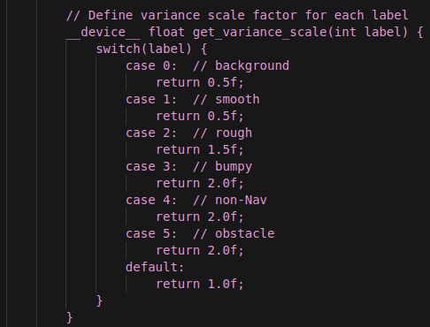

# 24년 12월 4주 회의

# 1. 목적

- 주간 회의

# 2. 장소, 시간, 참석자

- 장소 : 4층 중회의실
- 시간 : 2024/12/23(월) 15:00~18:00
- 참석자 :

# 3. 연구 내용 요약

## 3.1 최영주

- 

## 3.2 이한울

- 

## 3.3 김진우

- 저번 주
    
    진행사항
    
    - [x]  칼만필터 기반 확률정보로 고도맵 생성
    - [x]  RELLIS 3D 시멘틱 + 포인트 클라우드 생성
        - [ ]  Pose 정보 고도맵 적용
    - [ ]  RELLIS 3D 고도맵
    
- 이번 주
    - 칼만필터 기반 확률정보로 고도맵 생성
    - 제작한 고도맵 socre 계산
    - 저널 작성
    - 시멘틱 결과 후처리 알고리즘 가속화 방안 조사

## 3.4 이종록

### 3.4.1 전 주 업무 보고

### 소방 로봇

- [x]  맵 병합 기술 조사
    - [x]  `ICP_Localization` 모듈 테스트
    - 마무리는 하고 가기
    - 방향 정보와 위치 정보 제공 후 하기
    - 방향성은 자유롭게
    - **( 끊고 는가야함 )**

### 임업 로봇

- [ ]  

### 덤프 트럭

- [x]  카메라 ↔ 라이다 퓨전
    - [x]  경량화
        - [x]  BP-Net 폐기
        - [x]  DFU 모델 Pytorch → ONNX 변환
        - [x]  DFU 모델 ONNX → TensorRT(FP16) 변환
        - [x]  DFU 모델 ONNX IN8 양자화
        - [x]  DFU 모델 ONNX → TensorRT(INT8) 변환
        - [ ]  BP NET X →

### 기타

- [x]  Dooray 업무 페이지 작성

### 3.4.2. 금 주 업무 계획

### 소방 로봇

- [ ]  맵 병합 기술 조사
    - [ ]  QR 코드 활용 측위 방안 탐색

### 임업 로봇

- [ ]  

### 덤프 트럭

- [ ]  카메라 ↔ 라이다 퓨전
    - [ ]  경량화
        - [ ]  양자화 기술 정리
- [ ]  BEVFusion
    - [ ]  싱글 카메라 라이다 퓨전 방안 탐색

### 기타

- [ ]  이사 짐 정리

### BackPacking

- [ ]  ~~BEVFusion~~
    - [ ]  ~~싱글 카메라 라이다 퓨전~~

# 4. 결론

## 4.1 의사결정

## 4.2 숙제, 과제 수행 내용

### 4.2.1 최영주 연구원님

### 4.2.2 이종록 연구원

### 4.2.3 김진우 연구원님

## 4.3 다음 회의

# 5. 내용

## 5.1 최영주 연구원

## 5.2 이한울 연구원

## 5.3 김진우 연구원

1. 시멘틱정보를 적용하여 칼만필터 기반 고도맵 생성 → 분산값을 다르게 조정해 센서 정보 의지를 많이 하도록 제작

[new_data.mp4](new_data.mp4)

## 5.4 이종록 연구원

### 1. 맵 병합[`ICP_Localization`] ([ICP_Localization](https://www.notion.so/ICP_Localization-15eee36fc61c80a1bd27ea57fd79d99f?pvs=21) )

ICP_loc 실패 ⇒ 다른 방법 모색

### 2. Depth Completion ([Orin AGX 추론 시간 테스트](https://www.notion.so/Orin-AGX-162ee36fc61c8069a2a7f35e433acbd0?pvs=21) )

- 새로운 모델로 TensorRT INT8 양자화 성공
    - 추론 시간 Orin AGX 기준 ~ 60 ms 로 실시간 달성
    - 하지만, 너무 많은 연산으로 카메라의 해상도를 Resize 1/4로 해야함

### 3. Dooray 이슈 연동 완료 ([https://keti.dooray.com/](https://keti.dooray.com/))

---

# 6. 요구사항 (구매, 학회 기타 등등 이슈)

## 6.1 이한울 연구원님

## 6.2 최영주 연구원님

## 6.3 김진우 연구원님

- 코드 정리후 깃 업로드하기

## 6.4 이종록 연구원님

- maplab 참조한 논문으로 라이다 맵 병합 확인
- 깃랩  이슈 연동 확인

## 6.5 박민철 선임 제공

### 6.5.1 김진우 연구원님

- yolo-lidar fusion 클러스터링 진행. → 향후 비교군으로 사용

### 6.5.2 이한울 연구원님

- 12월 26일 목요일, 출장 신청 계정은 고민 필요
- 차량 렌트 알아보기 (비용 확인)
- 카메라, 라이다 캘리브레이션  확인( 적외선카메라)

### 6.5.3. 최영주 연구원님

- 잔상 남는 것 영상 확인 (100hz로 해서 영상 만들기, slack )
- Time stamped 찍기, 씽크 (우선순위 체크)
- bounding box 활용 (후처리 방법,  최영주연구원님 연구 )
- 내년 : 산림 환경 + ( 라이다 + 카메라 + 신규제어기 ) → 성능 98% + 두께정보 추출

### 6.5.4 이종록 연구원님

- 초기 위치 찾아내기
- map 병합하기

# 7. PPT 사진

# 8. 이사 관련

## 8.1 벽돌

→ 버리기 

박민철 선임 

- 메일로 물어보기
- 분해 미리 해놓기
- 30일 - 로봇 퀵으로 보낸다 함 (로봇, 나스)
- 레인보우에 메일→ dome형 32채널, L2 변경 요청 가능 예상

최영주 연구원님

→ 레인보우 로보틱스 재확인 요청 

- 본인 시스템 안에 check lists 만들기 필요

all

- 구매 리스트 각자 정리